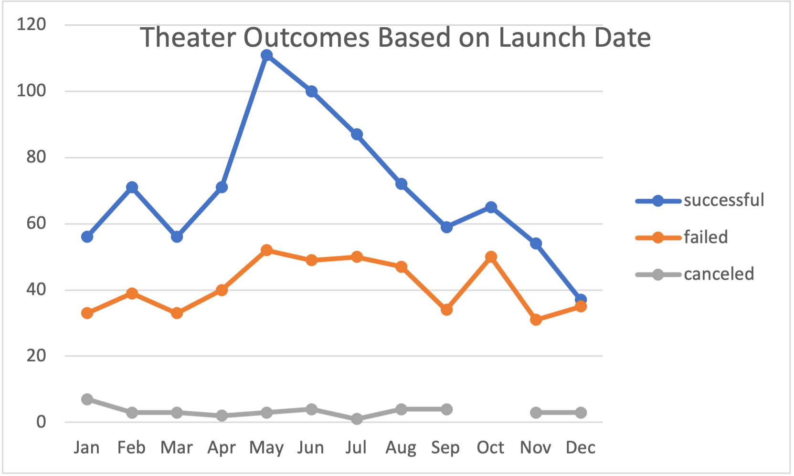
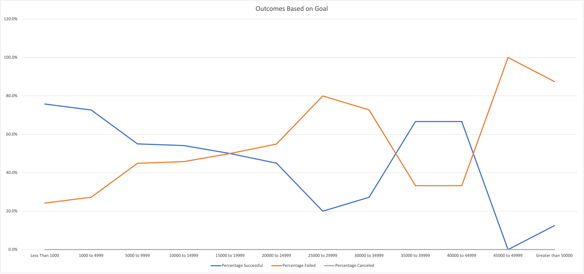

# Kickstarting with Excel

## Overview of Project

### Purpose

This goal of this project is to understand how different fundraisers performed based on timing of campaign and type of project funded.  An analysis of variables that impact these outcomes was performed as well to understand any future actions that could be taken to improve outcomes.  

## Analysis and Challenges

### Analysis of Outcomes Based on Launch Date

In order to analyze how theater fundraising projects performed based on launch timing, I compared the month of launch vs. the outcome grouped by successful, failed, or canceled campaigns (live campaigns were excluded from this analysis).  A pivot table was first created based on the filtering criteria required.  Some editing was needed for the monthly lables, since bringing in Date Created Conversion had some extraneous labels that weren't needed (i.e. years and quarters).  Once the pivot table was created, I built a line chart that showed a time series plot of project outcomes by month, as shown in the below image:

### Analysis of Outcomes Based on Goals

In addition to looking at the impact of timing on outcomes, an additional investigation was conducted into the impact of goals on project outcome. A table was constructed that compared outcomes at different goal levels across groups of successful, failed, and canceled projects.  The scope analysis was limited to the plays subcategory.  The appropriate data was brought in to the table through COUNTIFS formulas that extracted from the Kickstarter data tab.  

The final output was a line chart that showed the percentage of projects with a Successful or Failed outcome by grouping different goal levels:

### Challenges and Difficulties Encountered

The biggest struggle that I had was with the second portion of the challenge, when I initially forgot to include "Plays" as one of the criteria in the COUNTIFS statement.  However, my approach to fix this was to add the "plays" subcategory criteria to the formula for the first column (Successful projects), and then to copy that formula over to the next two columns and do a find and replace function to replace "successful" text with "failed" and "canceled" to reflect the appropriate outcome group.  

## Results

- What are two conclusions you can draw about the Outcomes based on Launch Date?

1. The best time to launch a theater campaign to increase the chances for success appears to be in the late spring or summer time (when looking at absolute counts).  I would avoid launching anything around the holidays (Nov/Dec) since those had the lowest numbers of successful campaigns.

1. There is not as much variablity in numbers of failed campaigns across months.  However, there are slightly more failed campaigns during the late spring and summer months.  Although there are also more campaigns overall occurring at this time.  

- What can you conclude about the Outcomes based on Goals?

The chance of a successful fundraiser diminishes with higher goal amounts.  Put simply, if you want to increase a campaign's chances for success, then you want to keep the goal amount low.  There is a change in that pattern in the $35-$45K amount range, which would be worthy of further exploration to understand other drivers of performance outside of goal amount.  

- What are some limitations of this dataset?

When looking at the success by month, the analysis is being done on absolute counts, not as a percentage.  It looks like there are a lot of campaigns in the summertime, which is making summer look like a highly successful time period, since there are more campaigns being launched during those months anyway.  A percentage based measurement would give a more level playing field across months, where some are slower than others.  

- What are some other possible tables and/or graphs that we could create?

It would be interesting to look at monthly success based on a percentage basis.  To investigate the $35-$45K play outcomes further, I would look at other potential contributors to success or failure (country, month, or any other identifiable attribute to differentiate the data set).  It would be great if we could have a data point that would speak to genre (e.g. comedy, drama, mystery, etc).  That seems like that could be a significant contributor to the success of these fundraisers as well.  